---

title: PastEvents
displaytext: Eventos Pasados
layout: null
tab: true
order: 3
tags: Peru

---

## Eventos 2020 

### OWASP Chapter Meeting Agosto
* Jueves, August 27, 2020 - 7:00 PM – 10:00 PM
* Reunión mensual de OWASP Lima Peru

<h3> Net and privacy - Melissa Nole Soto  (@meli_nsoto)</h3>
Melissa Nole es Ingeniera informática graduada de la pontificia universidad católica del Perú, con más de 9 años de experiencia en el campo de la seguridad. Soy miembro de diversas comunidades que promueven motivar a la mujer en el campo tecnológico

<h3>Secure Web Development Training for Agile Team - Nicolas Valcarcel (@nxvl) </h3>
Sobre la charla: 
OWASP Top 10 se hizo con un propósito: sacar a la luz los errores de desarrollo más comunes, para que puedan ser erradicados y podamos enfocarnos en diferentes 10. En los últimos lanzamientos de los mínimos, hemos visto los mismos repetirse una y otra vez mientras los desarrolladores siguen cometiendo los mismos errores. Los esfuerzos para capacitar a los desarrolladores en prácticas de codificación segura no se mantienen, ya que los desarrollan los profesionales de la seguridad, con la visión del mundo de los profesionales de la seguridad y los desarrolladores no están captando el mensaje o no están interesados. En esta charla, verá un nuevo enfoque de formación en codificación segura, centrada en los desarrolladores, la forma en que trabajan, sus herramientas y su entorno. El curso se puede seguir en su entorno habitual, como un editor de texto, IDE y git, siguiendo los flujos de trabajo que los desarrolladores experimentan en su día a día.
 Nicolas Valcárcel lidera la Seguridad de Productos en NextRoll. Trabaja en estrecha colaboración con Producto e Ingeniería para diseñar y definir requisitos y controles de seguridad en el desarrollo.
Durante su carrera, Nicolas ha tenido más de 5 años de experiencia ayudando a startups a diseñar la base de ingeniería en sus organizaciones como ingeniero y líder.

## Eventos 2019

* [OWASP Latam Tour 2019 - Perú.](https://twitter.com/OWASP_Peru/status/1127392848196788224)

 

## Eventos 2018

* OWASP Latam Tour 2018 - Perú.

 

## Eventos 2017

* OWASP Latam Tour 2017 - Perú.

	

 

## Eventos 2016

* Owasp Latam Tour 2016 - Perú.

  <b> TALLERES</b>
    <ul>
    	<li>Metasploit de la A a la Z en 8 horas <b>(Mauricio Urizar)</b></li>
    	<li>De 0 a Ninja con Kali Linux <b>(Jaime Andrés Restrepo) </b></li>
    </ul>

 

## Eventos 2015

* Owasp Latam Tour 2015 - Perú.

  

	
  

  <b> TALLERES</b>
    <ul>    	
    	<li>De 0 a Ninja con Kali Linux <b>(Jaime Andrés Restrepo) </b></li>
    	<li>Introducción a la Seguridad en Aplicaciones Web <b>(Fabio Cerullo)</b></li>
    </ul>

  

   

## Eventos 2014

* Owasp Latam Tour 2014 - Perú.

  

	
  

  

	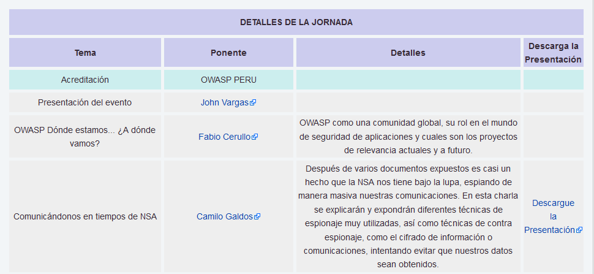
  

  

	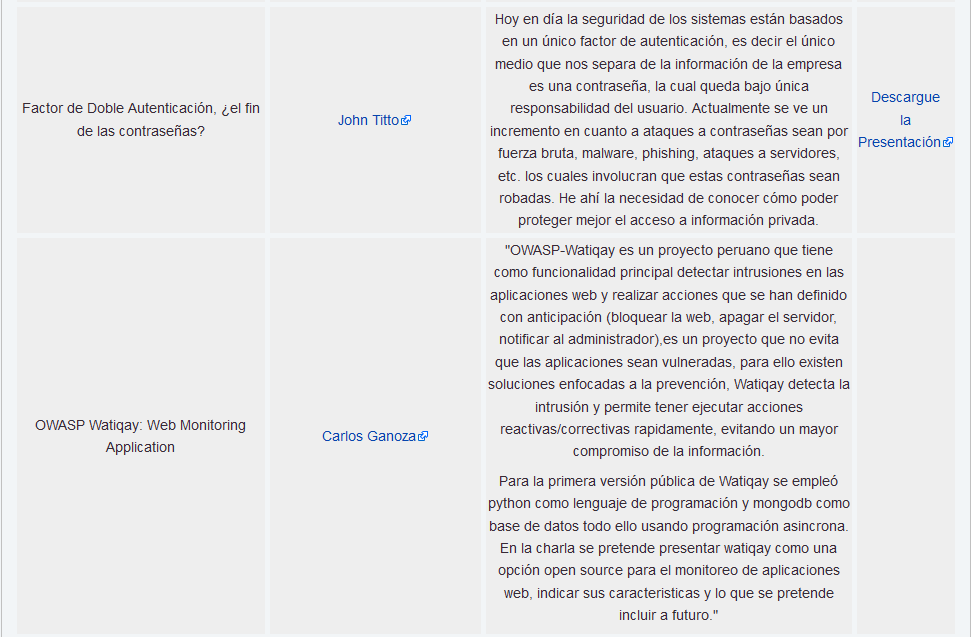
  

  

	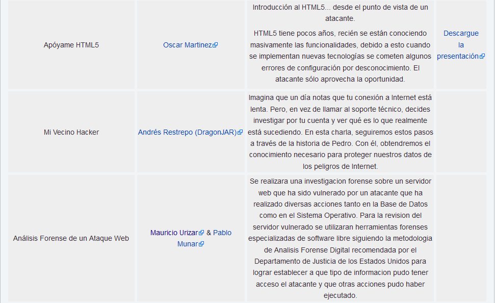
  

  

	
  

   

## Eventos 2013

* Owasp Latam Tour 2013 - Perú.

  

	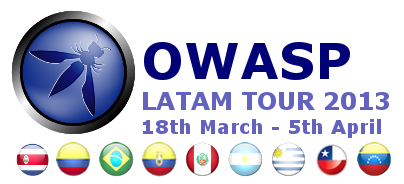
  

  <b> TALLERES</b>
    <ul>    	
    	<li>Taller de Análisis de malware: Métodos y técnicas - <b>Pablo Ramos (Argentina) </b></li>
    	<li>Taller Practico de Seguridad Web - <b>Jaime Andrés Restrepo Gomez (Colombia)</b></li>
    	<li>Taller Desarrollo Seguro usando OWASP ESAPI - <b>Fabio Cerullo (Irlanda)</b></li>
    </ul>
     

  

	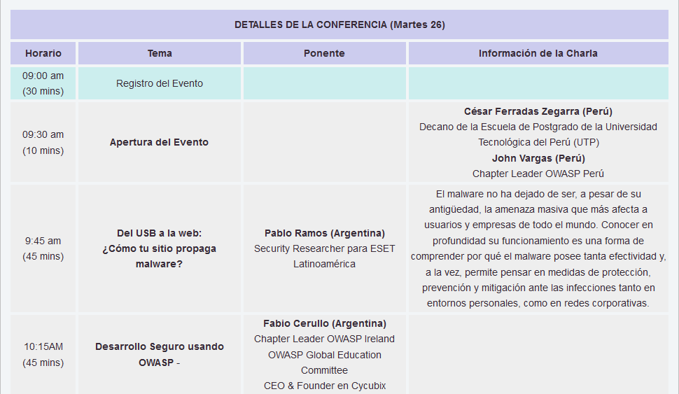
  

  

	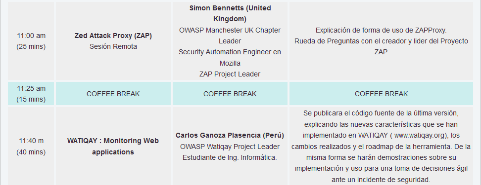
  

  

	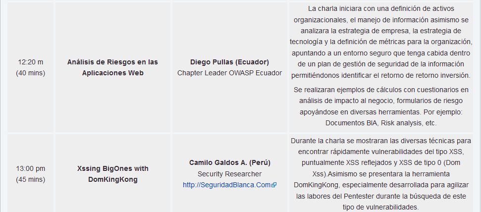
  

  

	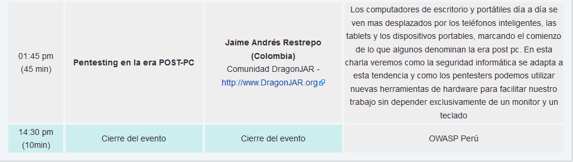
  

## Eventos 2012

* Owasp Latam Tour 2012 - Perú.

  

	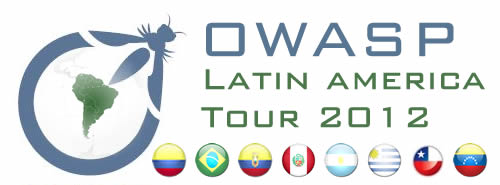	
  

   

  

	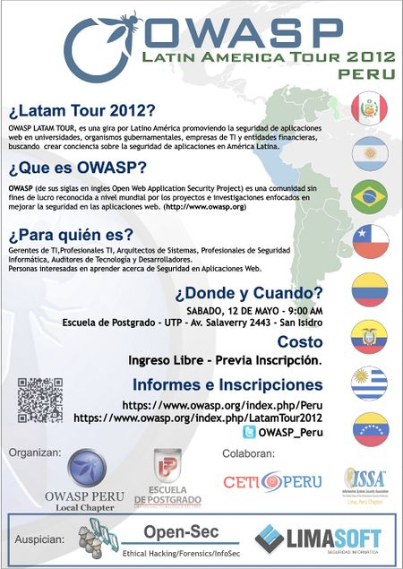
  

   

## Eventos 2011

* Owasp Latam Tour 2011 - Perú.

  

	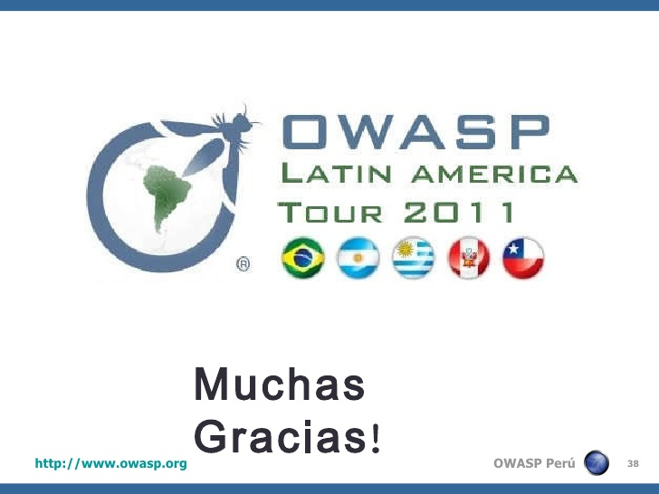
  

  

