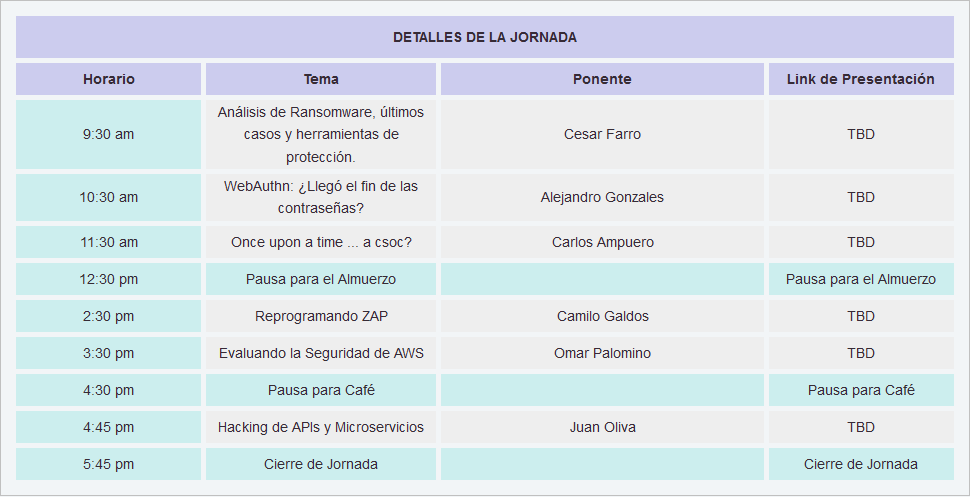
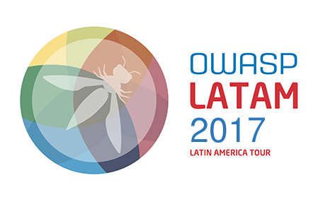
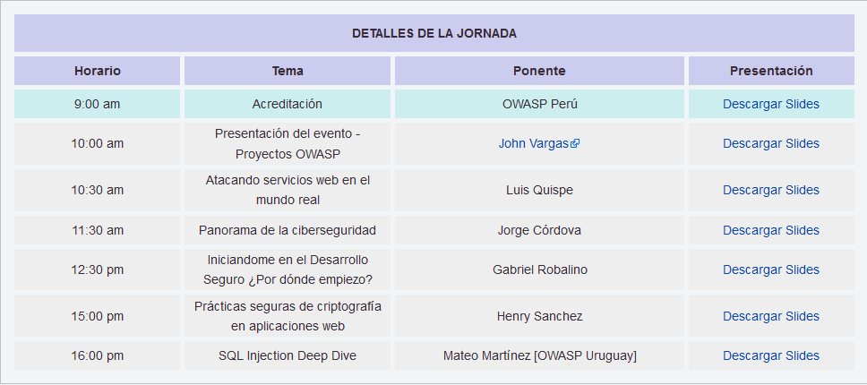
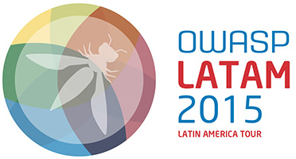
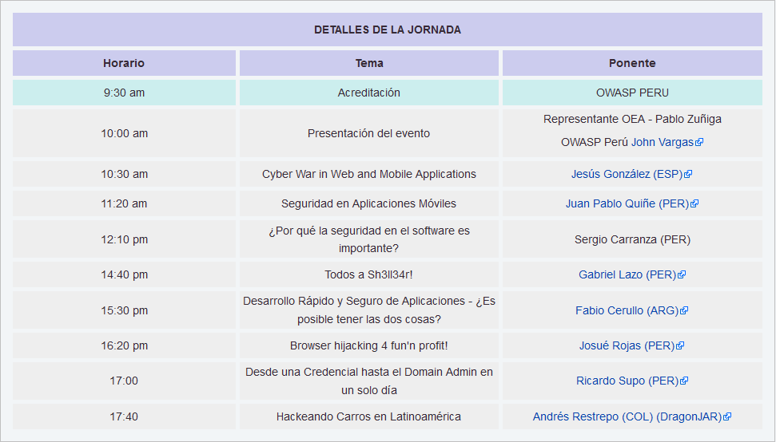
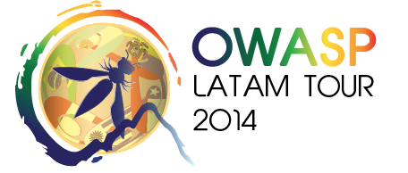

---

title: PastEvents
displaytext: Eventos Pasados
layout: null
tab: true
order: 3
tags: Peru

---

## Eventos 2019

* [OWASP Latam Tour 2019 - Perú.](https://twitter.com/OWASP_Peru/status/1127392848196788224)

 

## Eventos 2018

* OWASP Latam Tour 2018 - Perú.

 

## Eventos 2017

* OWASP Latam Tour 2017 - Perú.

	

## Eventos 2016

* Owasp Latam Tour 2016 - Perú.

  <b> TALLERES</b>
    <ul>
    	<li>Metasploit de la A a la Z en 8 horas <b>(Mauricio Urizar)</b></li>
    	<li>De 0 a Ninja con Kali Linux <b>(Jaime Andrés Restrepo) </b></li>
    </ul>

## Eventos 2015

* Owasp Latam Tour 2015 - Perú.

  

	
  

  <b> TALLERES</b>
    <ul>    	
    	<li>De 0 a Ninja con Kali Linux <b>(Jaime Andrés Restrepo) </b></li>
    	<li>Introducción a la Seguridad en Aplicaciones Web <b>(Fabio Cerullo)</b></li>
    </ul>

  

## Eventos 2014

* Owasp Latam Tour 2014 - Perú.

  

	
  

  

	
  

  

	
  

